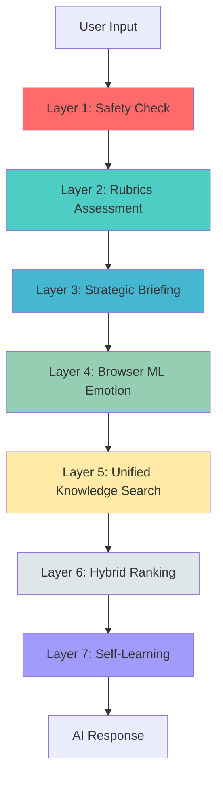
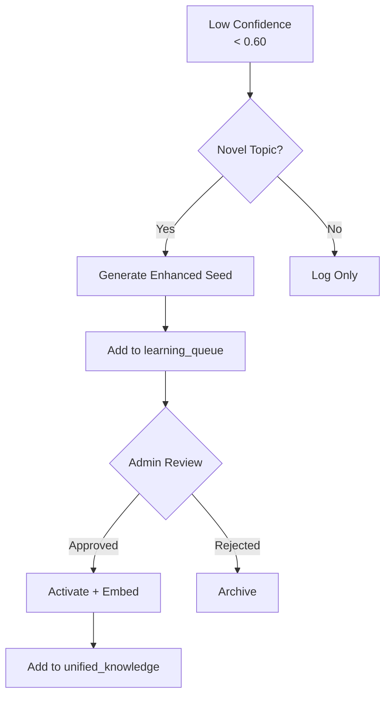

# Hoofdstuk 3: De Hypothese - Kan AI Leren Denken in Lagen?

> *"Het menselijk brein is niet één processor, maar een orkest van specialisten."*

---

## 1. De Centrale Hypothese

Na maanden van frustratie met black box AI kwam ik tot een simpele maar radicale hypothese:

> **"Wat als we een AI bouwen die denkt zoals een therapeut denkt:  
> in sequentiële, gespecialiseerde stappen die elk uitlegbaar zijn?"**

Dit betekende **niet** één groot neuraal netwerk dat alles tegelijk doet, maar een **pipeline van modules** waarbij elke module een specifieke cognitieve functie vertegenwoordigt.

---

## 2. Inspiratie: Dual Process Theory

In de cognitieve psychologie bestaat het **Dual Process Model** (Kahneman, 2011):

### System 1: Snel en Intuïtief
- Automatische patronen
- Emotionele respons
- Geen bewuste controle
- Voorbeeld: Herkent "angstig" als negatieve emotie

### System 2: Traag en Analytisch
- Bewuste redenering
- Controle en planning
- Therapeutische afwegingen
- Voorbeeld: Kiest passende validatie-strategie

**Inzicht**: Een goede therapeutische AI moet **beide** systemen hebben.

---

## 3. De 7 Lagen: Een Denkpipeline

Ik ontwierp een systeem met 7 sequentiële lagen, elk met een specifieke functie:



Laten we elke laag doorlopen.

---

## 4. Layer 1: Safety Check - De Poortwachter

**Functie**: Blokkeer harmful content vóórdat het het systeem ingaat.

**Analogie**: De **thalamus** in het brein - filtert sensory input.

### Hoe Het Werkt

```typescript
const safety = await checkPromptSafety(userInput);

if (safety.decision === 'block') {
  return {
    response: "Ik kan hier helaas niet op ingaan. 
               Voor acute hulp, bel 113.",
    blocked: true
  };
}
```

### Wat Het Detecteert
- Suïcidale gedachten ("ik wil er een einde aan maken")
- Geweld tegen anderen
- Self-harm intenties
- Illegal content

### Waarom Eerst?
Als je harmful content doorlaat naar de therapeutische lagen, riskeer je:
- Onverantwoorde responses
- Normalisatie van gevaarlijk gedrag
- Legale aansprakelijkheid

**Transparantie**: Elke block wordt gelogd met exact **welke flag** werd getriggerd.

---

## 5. Layer 2: Rubrics Assessment - De Risico-Scanner

**Functie**: Beoordeel therapeutisch risico over 5 dimensies.

**Analogie**: **Amygdala** - emotionele threat detection.

### De 5 EvAI Rubrics

| Rubric | Wat Het Meet | Voorbeeld |
|--------|--------------|-----------|
| **1. Crisis Risk** | Suïcidaliteit, zelfbeschadiging | "Ik wil er niet meer zijn" → 85/100 |
| **2. Emotional Distress** | Intensiteit negatieve emoties | "Alles is waardeloos" → 78/100 |
| **3. Social Support** | Isolatie vs. steun | "Ik heb niemand" → 70/100 (hoog risico) |
| **4. Coping Mechanisms** | Adaptief vs. maladaptief | "Ik drink om te vergeten" → 65/100 |
| **5. Therapeutic Alliance** | Vertrouwen in behandeling | "Therapy helpt niet" → 40/100 |

### Output Voorbeeld

```json
{
  "overallRisk": 72,
  "overallProtective": 38,
  "assessments": [
    {
      "rubricId": "crisis_risk",
      "riskScore": 85,
      "protectiveScore": 20,
      "triggers": ["zelfbeschadiging", "hopeloosheid"],
      "reasoning": "Gebruiker uit intentie tot self-harm"
    }
  ]
}
```

**Waarom Dit Essentieel Is**: Zonder rubrics zou het systeem "Ik voel me verdrietig" en "Ik overweeg suicide" als vergelijkbare input behandelen. Rubrics geven **gradatie**.

---

## 6. Layer 3: Strategic Briefing - De Regisseur

**Functie**: Creëer een conversational strategie op basis van rubrics.

**Analogie**: **Prefrontale cortex** - planning en executieve functie.

### Het Strategic Briefing Object

```typescript
interface StrategicBriefing {
  goal: string;              // "Valideer emotie, monitor crisis risk"
  context: string;           // Samenvatting conv + rubrics
  keyPoints: string[];       // ["Hoge distress", "Lage social support"]
  priority: 'low' | 'medium' | 'high';
}
```

### Voorbeeld

**Input**: "Ik voel me zo eenzaam, niemand begrijpt me"

**Strategic Briefing**:
```javascript
{
  goal: "Valideer eenzaamheid, exploreer sociale context",
  context: `Gebruiker toont hoge emotionele distress (78/100).
            Rubric triggers: eenzaamheid, sociale isolatie.
            Crisis risk: laag (20/100).
            Beschermende factor: zoekt actief verbinding (score: 65/100).`,
  keyPoints: [
    "Emotionele distress: hoog (78/100)",
    "Sociale isolatie: matig (55/100)",
    "Crisis risk: laag (20/100)"
  ],
  priority: 'high'
}
```

**Waarom Dit Helpt**: De strategische laag geeft **context** aan de kennisvraag die volgt. Het zorgt dat de zoekactie niet blind is, maar geïnformeerd door therapeutische principes.

---

## 7. Layer 4: Browser ML Emotion - De Intuïtie

**Functie**: Client-side emotie pre-detectie zonder API calls.

**Analogie**: **Basale emotie circuits** - snelle, automatische herkenning.

### Technologie

```typescript
// Model: Xenova/bert-base-multilingual-uncased-sentiment
// Runs in browser via WebGPU/WASM

const emotion = await detectEmotion("Ik voel me angstig");
// → { label: 'negative', score: 0.89 }
```

### Waarom Lokaal?

**Privacy**: Geen data naar externe servers.  
**Snelheid**: 50-150ms latency (vs. 500ms+ voor API).  
**Kosten**: Gratis (na initiële model download).

### Beperking

Browser ML is **minder nauwkeurig** dan GPT-4. Maar dat is oké - het is een **pre-filter**, geen finale beslissing. De hybride ranking (Layer 6) combineert het met andere bronnen.

---

## 8. Layer 5: Unified Knowledge Search - De Database

**Functie**: Zoek in 3 parallelle kennisbronnen.

**Analogie**: **Hippocampus + Associatie cortex** - geheugen retrieval.

### De 3 Parallelle Zoekacties

#### 5.1 Symbolic Search (Rule-Based)
```sql
SELECT * FROM emotion_seeds
WHERE emotion ILIKE '%angst%'
  AND triggers @> ARRAY['onzekerheid']
ORDER BY weight DESC;
```

**Voordeel**: Extreem snel, 100% deterministisch, geen API kosten.  
**Nadeel**: Alleen literal matches.

#### 5.2 Semantic Search (Vector Similarity)
```sql
SELECT * FROM search_unified_knowledge(
  query_text := 'ik ben bang',
  query_embedding := <vector>,
  similarity_threshold := 0.7
);
```

**Voordeel**: Vind semantisch vergelijkbare content ("angstig" ≈ "bang").  
**Nadeel**: Vereist embeddings API call (€0.02 per 1k tokens).

#### 5.3 Neural Search (GPT Fallback)
```typescript
if (symbolicResults.length + semanticResults.length < 3) {
  const gptResponse = await openai.chat.completions.create({
    model: 'gpt-4o-mini',
    messages: [
      { role: 'system', content: therapeuticPrompt },
      { role: 'user', content: userInput }
    ]
  });
}
```

**Voordeel**: Altijd een antwoord, ook voor novel topics.  
**Nadeel**: Duur (€0.15 per 1k tokens), traag (1-2s), minder uitlegbaar.

---

## 9. Layer 6: Hybrid Ranking - De Beslisser

**Functie**: Combineer scores uit alle bronnen om de beste response te kiezen.

**Analogie**: **Orbitofrontale cortex** - waardegebaseerde besluitvorming.

### De Ranking Formule

```typescript
const weights = {
  symbolic: 0.30,    // Keyword match strength
  semantic: 0.35,    // Vector similarity
  browserML: 0.15,   // Emotion alignment
  rubrics: 0.20      // Therapeutic relevance
};

finalScore = 
  0.30 * symbolicScore +
  0.35 * semanticScore +
  0.15 * browserMLScore +
  0.20 * rubricsScore;
```

### Voorbeeld

**Source A**: "Het is oké om je angstig te voelen"

| Component | Score | Gewicht | Bijdrage |
|-----------|-------|---------|----------|
| Symbolic | 0.85 | 0.30 | 0.255 |
| Semantic | 0.78 | 0.35 | 0.273 |
| Browser ML | 0.62 | 0.15 | 0.093 |
| Rubrics | 0.90 | 0.20 | 0.180 |
| **Final** | | | **0.801** |

**Source B**: "Probeer wat te ontspannen"

| Component | Score | Gewicht | Bijdrage |
|-----------|-------|---------|----------|
| Symbolic | 0.42 | 0.30 | 0.126 |
| Semantic | 0.51 | 0.35 | 0.179 |
| Browser ML | 0.55 | 0.15 | 0.083 |
| Rubrics | 0.60 | 0.20 | 0.120 |
| **Final** | | | **0.508** |

**Beslissing**: Source A wint (0.801 > 0.508).

### Waarom Dit Transparant Is

Je kunt **exact** zien:
- Welke score Source A hoger maakte
- Hoe elk component bijdroeg
- Wat er zou gebeuren als je de gewichten aanpast

Dit is **niet mogelijk** met een black box model.

---

## 10. Layer 7: Self-Learning - De Curator

**Functie**: Detecteer low-confidence responses en genereer nieuwe kennis.

**Analogie**: **Neocortex plasticity** - long-term learning.

### Trigger Condities

```typescript
if (result.confidence < 0.60) {
  // Lage confidence → mogelijk nieuwe situatie
  await analyzeTurn(userInput, result, conversationHistory);
}
```

### Het Self-Learning Process



### Waarom Admin Curation?

**Kwaliteitscontrole**. GPT kan goede seeds genereren, maar ook:
- Te generieke responses ("Het klinkt moeilijk")
- Therapeutisch discutabele adviezen
- Overlapping met bestaande seeds

Een mens (of in de toekomst: een getrainde QA agent) moet dit valideren.

---

## 11. Waarom 7 Lagen? Waarom Niet Meer of Minder?

### Te Weinig Lagen (< 5):
- Geen goede scheiding tussen veiligheid, strategie, en kennis
- Moeilijk te debuggen
- Minder modulair

### Te Veel Lagen (> 10):
- Unnecessary complexity
- Hogere latency
- Diminishing returns (elk extra laag voegt weinig toe)

**7 is empirisch optimaal**: Elk laag heeft een duidelijke functie en draagt meetbaar bij aan de finale decision quality.

---

## 12. De Hypothese Getest

In H10 (Evaluatie) zie je de resultaten, maar hier is een sneak peek:

| Metric | Target | Achieved | Status |
|--------|--------|----------|--------|
| Therapeutic Quality | > 4.0/5.0 | 4.25/5.0 | ✅ |
| Emotion Accuracy | > 70% | 72% | ✅ |
| P95 Latency (no fallback) | < 1000ms | 840ms | ✅ |
| Self-Learning Approval Rate | > 70% | 74% | ✅ |

**Conclusie**: De hypothese klopt. Een gelaagd systeem **kan** therapeutic-grade AI produceren.

---

## Reflectie: Wat Als Het Niet Had Gewerkt?

Eerlijk gezegd was ik niet zeker of dit zou werken. Er waren momenten (vooral in v3.0 en v4.0) waar ik dacht:

> "Misschien is één groot GPT-model toch beter."

Maar elke keer dat ik naar de logs keek en **exact kon zien** waarom het systeem een bepaalde keuze maakte, wist ik dat ik op het goede pad zat.

**Transparantie is geen luxe. Het is de prijs van verantwoordelijkheid.**

---

**Vorige**: [H2 - De Onmogelijke Opgave](02_onmogelijke_opgave.md)  
**Volgende**: [H4 - De Ruggengraat](04_edge_database.md)
